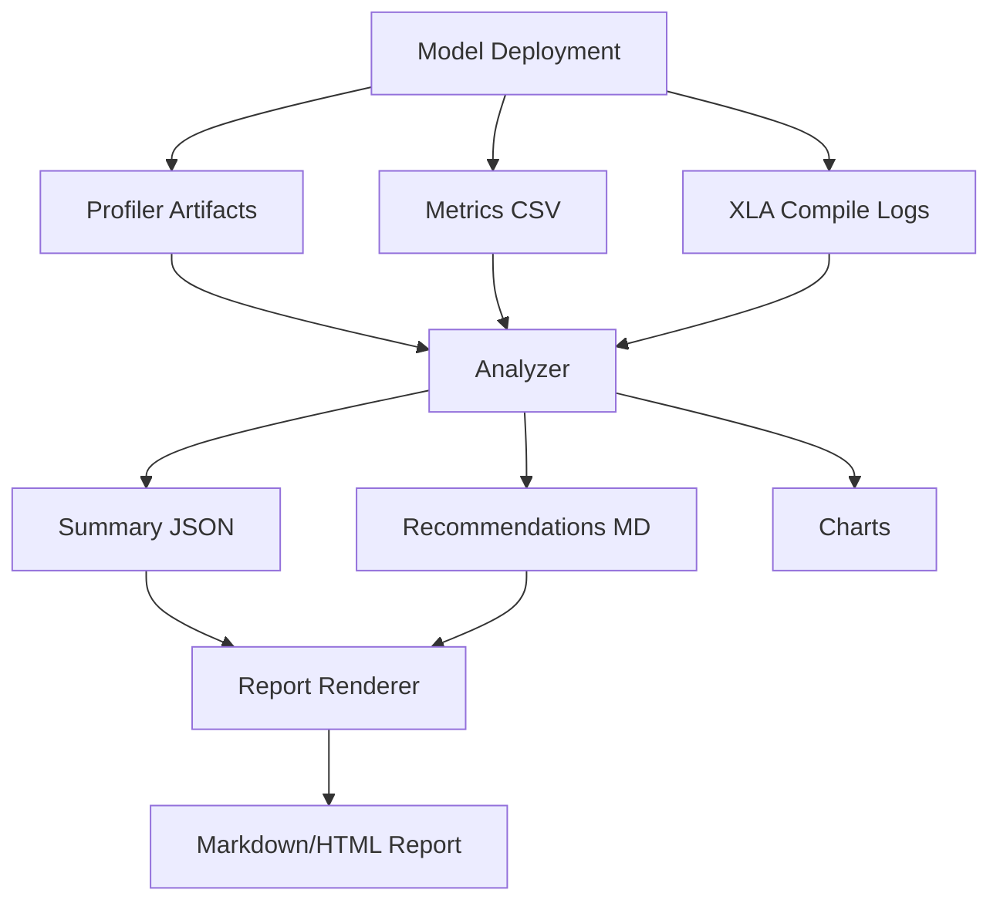

# Architecture

The analyzer is intentionally simple: it reads profiling artifacts, normalizes metrics, applies heuristics, and emits a ranked recommendation list.

```mermaid
graph TD
  A[Model Deployment] --> B[Profiler Artifacts]
  A --> C[Metrics CSV]
  A --> D[XLA Compile Logs]
  B --> E[Analyzer]
  C --> E
  D --> E
  E --> F[Summary JSON]
  E --> G[Recommendations MD]
  E --> H[Charts]
  F --> I[Report Renderer]
  G --> I
  I --> J[Markdown/HTML Report]
```
